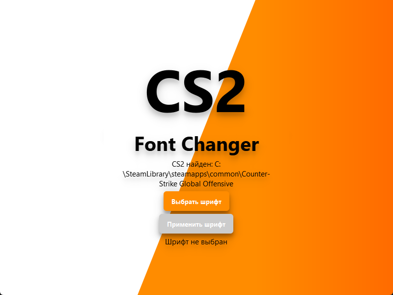

[EN instruction](https://github.com/N1k3YB/CS2FontChanger_en)

# CS2 Font Changer

## Обзор
CS2 Font Changer - это графическая утилита для **изменения конфигурации шрифтов** в *Counter-Strike 2 (CS2)*, позволяющая легко заменять стандартный шрифт игры на пользовательский. Этот инструмент использует **PyQt6** для интерфейса и выполняет модификации в директории игры CS2 для настройки файлов `fonts.conf` и `42-repl-global.conf` с указанным шрифтом.

## Функции  
* **Автоматический поиск**: Автоматически находит директорию установки CS2  
* **Выбор шрифта**: Позволяет пользователям выбирать любой файл шрифта `.ttf` или `.otf`  
* **Настройка**: Обновляет необходимые конфигурационные файлы CS2 с новыми настройками шрифта  
* **Резервное копирование**: Создает резервные копии оригинальных конфигурационных файлов в файлы `.backup` на случай необходимости восстановления  

## Установка и использование  
1. **Скачивание приложения**:  
   * А. Скачайте архив с [однофайловым](https://disk.yandex.ru/d/0575C5yoMpV6bQ) либо [модульным](https://disk.yandex.ru/d/y8mD00afzY_9pA) приложением
   * Б. Распакуйте в удобную для вас папку
   * В. Запустите приложение

2. **Выбор пути к CS2** (если не определен автоматически):
   * Если путь до CS2 не найден автоматически, выберите директорию вручную

3. **Выбор шрифта**:
   * Нажмите на **"Выбрать шрифт"** для выбора файла шрифта с вашего компьютера

4. **Применение шрифта**:
   * Нажмите **"Применить шрифт"** для изменения настроек шрифта CS2
   * После завершения появится сообщение об успехе

## Изменяемые файлы в CS2
1. `fonts.conf`: Основной конфигурационный файл для обработки шрифтов в CS2
2. `42-repl-global.conf`: Файл настроек подстановки шрифтов

Резервные копии этих файлов создаются с расширением `.backup`.

## Устранение неполадок  
* **Шрифт не применяется**: Убедитесь, что файл шрифта **не находится в той же директории**, что и файл `fonts.conf`  
* **Проблемы с правами доступа**: При необходимости запустите приложение с соответствующими правами  
* **Восстановление оригинального шрифта**: Замените измененные файлы версиями `.backup` в конфигурационных папках CS2  
